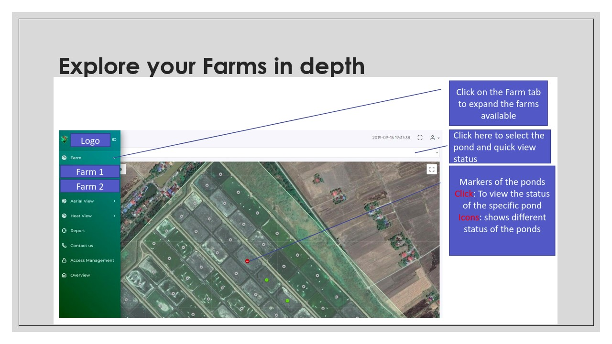

## Farm Management Template
### How to setup the project in your local system
`sudo add-apt-repository ppa:ondrej/php`  
`sudo apt-get update`  
`sudo apt-get install apache2 libapache2-mod-php7.2 php7.2 php7.2-xml php7.2-gd php7.2-opcache php7.2-mbstring`  
`cd /tmp`  
`curl -sS https://getcomposer.org/installer | php`  
`sudo mv composer.phar /usr/local/bin/composer`  
`cd /var/www/html`  
`sudo chgrp -R www-data /var/www/html/Your Project Name`  
`sudo chmod -R 775 /var/www/html/Your Project Name/storage`  
`cd /etc/apache2/sites-available`  
`sudo echo "<VirtualHost *:80>`  
`ServerName 0.0.0.0`  
`ServerAdmin webadmin@admin`  
`DocumentRoot /var/www/html/ProjectName/public`  
`<Directory /var/www/html/ProjectName>`  
`AllowOverride All`  
`</Directory>`  
`ErrorLog ${APACHE_LOG_DIR}/error.log`  
`CustomLog ${APACHE_LOG_DIR}/access.log combined`  
`</VirtualHost>" >> laravel.conf`  
`sudo a2dissite 000-default.conf`  
`sudo a2ensite laravel.conf`  
`sudo a2enmod rewrite`  
`sudo service apache2 restart`  

## All done , type `http://127.0.0.1` in your preferred browser and you should see the project
## Fore live Demo Please contact my [Email](mailto:kankan_sarkar@outlook.com)

